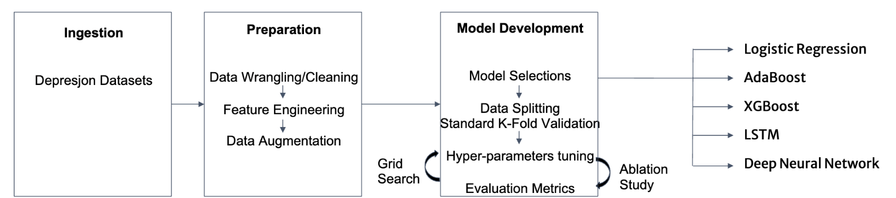
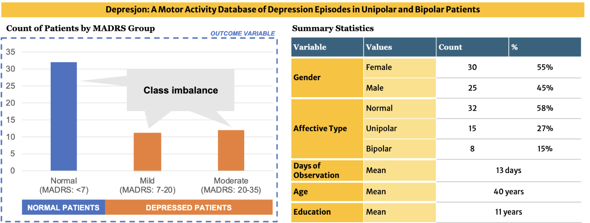
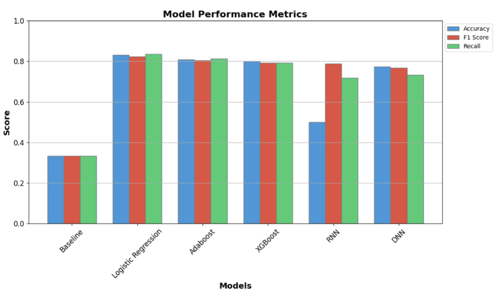

# Mind in Motion: Machine Learning for Depression Classification using Motor Actigraphy Data

## Introduction

Depression is a complex mental health condition that affects millions of people worldwide. Traditionally, the diagnosis and classification of depression have heavily relied on subjective assessments by clinicians. However, advancements in wearable technology and machine learning present an opportunity to develop objective and data-driven approaches for depression classification.

In this project, we explore the use of motor actigraphy data collected from wearable devices to classify patients with depression. Motor actigraphy provides valuable information about individuals' physical activity and inactivity patterns, which can be indicative of their mental health status.

## Goals

- Utilize machine learning techniques to classify patients with depression based on motor actigraphy data.
- Extract relevant features from the motor actigraphy data to enhance classification performance.
- Investigate the impact of different machine learning algorithms on the classification task.
- Evaluate the model's performance using appropriate metrics and validation strategies.

## Dataset

The dataset used in this project comprises motor actigraphy recordings collected from individuals diagnosed with depression. The data includes various activity bouts and inactivity bouts captured over an extended period. Additionally, demographic and clinical information, such as the severity of depression (assessed using the MADRS scale) and the patient's diagnosis (bipolar, unipolar, or normal), are also provided.

### Source:
Enrique Garcia-Ceja, Michael Riegler, Petter Jakobsen, Jim Tørresen, Tine Nordgreen, Ketil J. Oedegaard, Ole Bernt Fasmer. (2018). Depresjon: A Motor Activity Database of Depression Episodes in Unipolar and Bipolar Patients. In Proceedings of the 9th ACM on Multimedia Systems Conference (MMSys'18). Amsterdam, The Netherlands. ACM. [DOI: 10.1145/3204949.3208125](http://doi.acm.org/10.1145/3204949.3208125)

## Methodology

1. Data Preprocessing: We consolidated individual time series motor actigraphy data files for each patient with patient demographic and MADRS score data into a single dataset, calculated label variables, and performed data cleaning.

3. Feature Extraction: We performed feature engineering to extract relevant patterns from the motor actigraphy data.

4. Feature Selection: To enhance model performance and reduce dimensionality, we employed feature selection techniques to identify the most informative features.

5. Data Augmentation: To improve model stability and address class imbalance, we performed cross-subject data fusion to create synthetic samples.

5. Model Building: We employed logistic regression, Adaboost, XGBoost, LTSM, and standard neural networks to build models for depression classification. For each, we conducted hyperparameter tuning using ablation analysis / grid search.

6. Evaluation: The performance of each model was evaluated using standard K-fold cross validation and various metrics, including accuracy, recall, and F1-score.

## Results

Our models achieved promising results in classifying patients with depression based on motor actigraphy data, with logistic regression achieving 83%, 82%, and 84% accuracy, F1 score and recall, respectively.

## Usage

1. Clone the repository to your local machine.
2. Install the required dependencies using `pip install -r requirements.txt`.
3. Run the Jupyter notebooks to conduct data preprocessing, perform feature extraction and selection, conduct data augmentation, and build and evaluate machine learning models.

Note: due to filesize restrictions on github a csv called "data_augmented.csv" needs to be downloaded from google drive: https://drive.google.com/file/d/1YFsUk2InK1DFwCevVFNTWX3YY8JEWu2a/view?usp=sharing and should be saved under data/processed. This file is needed to run the models and evaluation notebook.

## Future Work

While our current models show promising results, there is still scope for improvement. Future work could involve:

- Exploring additional features from motor actigraphy data or combining it with other types of data (e.g., demographic data included in the raw data source)
- Further fine-tuning model hyperparameters to optimize performance further.
- Evaluating the model's generalizability on an external dataset.

## Contributors
- [Gary Kong] - Data preprocessing, feature extraction and selection, logistic regression
- [Julia Kauffman] - Data augmentation, cross-validation, LTSM, standard neural network
- [Leo Le] - Cross-validation, Adaboost (Lead), XGBoost (Lead)
- [Vishnu Paty] - Cross-validation, Adaboost (Support), XGBoost (Support), Model evaluation
- [Melia Soque] - Cross-validation, Logistic regression

Project Organization
------------

    ├── README.md                                                      <- The top-level README for developers using this project
    ├── data
    │   ├── processed                                                  <- The final, canonical data sets for modeling
    │   └── raw                                                        <- The original, immutable data
    │
    ├── notebooks                                                      <- Jupyter notebooks
    │   ├── w207_1_preprocessing_feature engineering_augmentation      <- Data preprocessing, feature extraction and selection, and data augmentation notebook
    │   └── w207_2_models_and_evaluation                               <- Models (Logistic regression, XGBoost, AdaBoost, LTSM neural network, standard neural network) and model evaluation
    │
    ├── presentations                                                  <- Presentations
    │   ├── W207_Baseline Presentation                                 <- Baseline presentation
    │   └── w207_Final PResentation                                    <- Final presentation
    │
    ├── references                                                     <- Selected research reports on the topic
    │
    ├── requirements.txt                                               <- The requirements file for reproducing the analysis environment, e.g.
    │                                                                     generated with `pip freeze > requirements.txt`

--------
